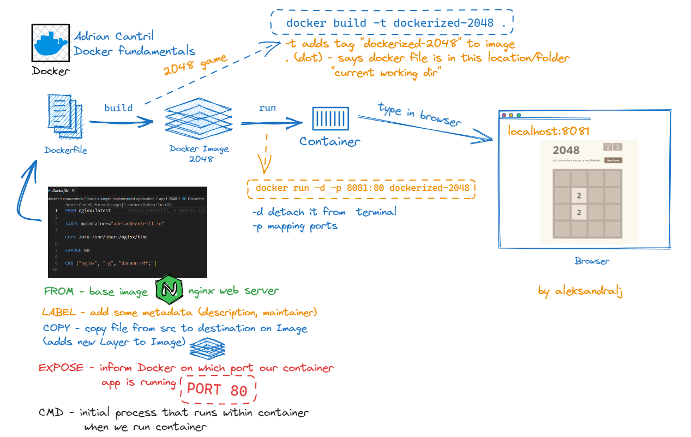

# Prereqs

Make sure you have the course github repo cloned/downloaded to your local machine.

Locate the `build-a-simple-containerized-application` folder in the course repo. 

# Application 1 - 2048


*Diagram shows the flow -  from the Dockerfile to the fun playing game!*
## Creating a 2048 Docker Image

Move into the `app1-2048` folder.  
open the `Dockerfile` in a text editor of choice.  
Notice how there are `5` lines .. FROM, LABEL, COPY, EXPOSE and CMD. When you build the docker image in the next step, pay attention to how many layers are created in the image.  

This Dockerfile uses the latest version of the `nginx` image (which includes a configured installation of NGINX).  

https://hub.docker.com/_/nginx  

It sets metadata `maintainer`. It then copies all of the `2048/` folder from the localdocker host/client machine into the `/usr/share/nginx/html` folder within the image.  

Finally we use the `EXPOSE` directive to inform uses of this image that the appplication is running on `tcp/80` and use the `CMD` statement to set the initial process for containers running from this image.  

To build the image, from the `app1-2048` folder we run the docker build command. We use `-t` to tag the image with `2048` and use `.` to set the working directory for the command. ANy paths specified in the dockerfile will use `.` as the starting point ..the working directory.  

```docker build -t dockerized-2048 .```

Notice how 2 layers are created in the docker image. 

- The first layer is the base image `nginx:latest`. 
- The last layer is created based on the `COPY` statement to copy in the application files from `./2048`.  

## Running a 2048 Docker Container

Run a `docker images` to show all images on the Docker Host.  
Locate the `dockerized-2048` image which you just created.  
This image, is running an application using `tcp/80` so we need to use the `-p` CLI option to run this on an alternative docker host post (this will be discussed in detail later in the course).  

Run a docker container of 2048 using 

`docker run -d -p 8081:80 dockerized-2048`  

this will run in detached mode, so your terminal should return to the prompt immediately.  

Verify the container is running with `docker ps`. Confirm the port mapping with `docker port <CONTAINERID>`.  

Browse to `http://localhost:8081`  

Play the game :)

## Cleanup

Run a `docker stop <CONTAINERID>` to stop the 2048 container app.  
Run a `docker rm <CONTAINERID>` to remove the 2048 container.  

# Application 2 - Container of Cats

This dockefile is intentionally less efficient than app1 above. I want you to understand WHY it's less efficient.  

## Creating a Container of Cats Docker Image

Move into the `app2-containerofcats` folder.  
open the `Dockerfile` in a text editor of choice.

Let's review this `Dockerfile` and specifically identify how it's different from the previous `app1`. 

- First, it uses a different base image. Instead of `nginx:latest` which is specifically designed for simple `ngnix` web use-cases, this uses `ubi8` which is a universal redhat 8 image (general purpose)
- This image is also larger than other lean image such as `alpine` and `nginx`.
- Because this is a general purpose image, we have to install a web server (apache2) in this case via the `RUN` statement. This creates a layer.
- Next, there are 2 x `COPY` statements which copy in `index.html` and `contaierandcat*.jpg` media files into the image. These two statements create _2_ additional layers.  

This dockerfile and resultant image are more generalised. This results in a larger image, and containers which consume more resources.  

To create a docker image for the `containerofcats` dockerized application we run this command.  

```docker build -t containerofcats .```

*notice how much longer it takes to create, vs the 2048 image, even though it's a similar architecture .. web server & some files*  

## Running a containerofcats Docker Container  

Run a `docker images` to show all images on the Docker Host.  
Locate the `containerofcats` image which you just created.  
This image, is running an application using `tcp/80` so we need to use the `-p` CLI option to run this on an alternative docker host post (this will be discussed in detail later in the course).  

Run a docker container of containerofcats using 

`docker run -d -p 8081:80 containerofcats`  

this will run in detached mode, so your terminal should return to the prompt immediately.  

Verify the container is running with `docker ps`. Confirm the port mapping with `docker port <CONTAINERID>`.  

Browse to `http://localhost:8081`  

## Cleanup

Run a `docker stop <CONTAINERID>` to stop the containerofcats container app.  
Run a `docker rm <CONTAINERID>` to remove the containerofcats container.  

